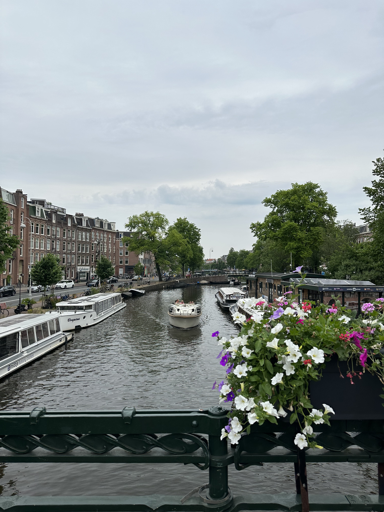

An Amsterdam canal.

_TL;DR;_

* 3 days in Amsterdam 🇳🇱!
* Biking everywhere 🚲🚴‍♂️🛎️.
* Enjoyed plenty of food 🥞🍦🍔🥙.
* Diet update.

## 3 days in Amsterdam 🇳🇱

Oh, man! Lovely weather; I met many new friends, ate great food, and biked A LOT! Amsterdam in the summertime is such a beautiful place to visit. A lot like London, actually.

I flew in Friday evening and left Sunday night. Getting to the city centre from the airport is so easy! And the flight from Heathrow was just a bit over an hour! I am definitely going to visit more often. It was so quick!

This is actually my 3rd time in Amsterdam. My first visit was when I got my current job cause my team is based in Amsterdam. So every time I visit colleagues there. I met a couple for drinks on Friday night (Fridays are half-days at work) and a few others on Saturday. It was great catching up with all of them again!

Hotel prices in Amsterdam were so ridiculous that I had a friend host me. It was great; I felt like a student again.

My girlfriend and her friend also flew from Greece and watched Beyonce on Saturday. Apparently, it was spectacular, but I don't think I'd attend 😅.

## Biking everywhere 🚲🚴‍♂️🛎️

All commuting I did, I did it with the bike. I measured it, and it added 500 🔥 calories to my daily "move" goal every day. That is amazing! And because Amsterdam is mainly flat, you don't even feel it.

I don't know how it is during the winter months 🥶. My friend told me that with the right gear, you don't feel anything, so I'll go by his word for now.

I'm considering renting a bike here in London when I return from Greece. I'll need to travel daily for training sessions and other activities, which'll be a nice trial.

The most we spent biking in a single go was 25-30 minutes, which is rare. We were just so far away from the house. The good thing is, even if it's not foldable, you can get on public transport with a bike.

Also, Amsterdam is a bike-first city, so drivers respect the bike riders, making it safer.

## Fooooood 🥞🍦🍔🥙

As I've written in this blog, Sunday is God's day. Pancakes 🥞, burger 🍔, ice cream 🍦! I had to have it! I also ate at a couple of Turkish places, the usual doner kebab places, and it was lovely; it felt homemade, like my mum made it, which is always an appreciative feeling 🥰!

## Diet update

Other than this Sunday outburst diet has been going ok. I've been consistently doing the low-carb (up to 50g carbs) diet and seeing the results in the mirror. I will push 2 more weeks like this until I go to Crete. After that, I will hit the gym hard 🏋🏻and the bulking season will start!
