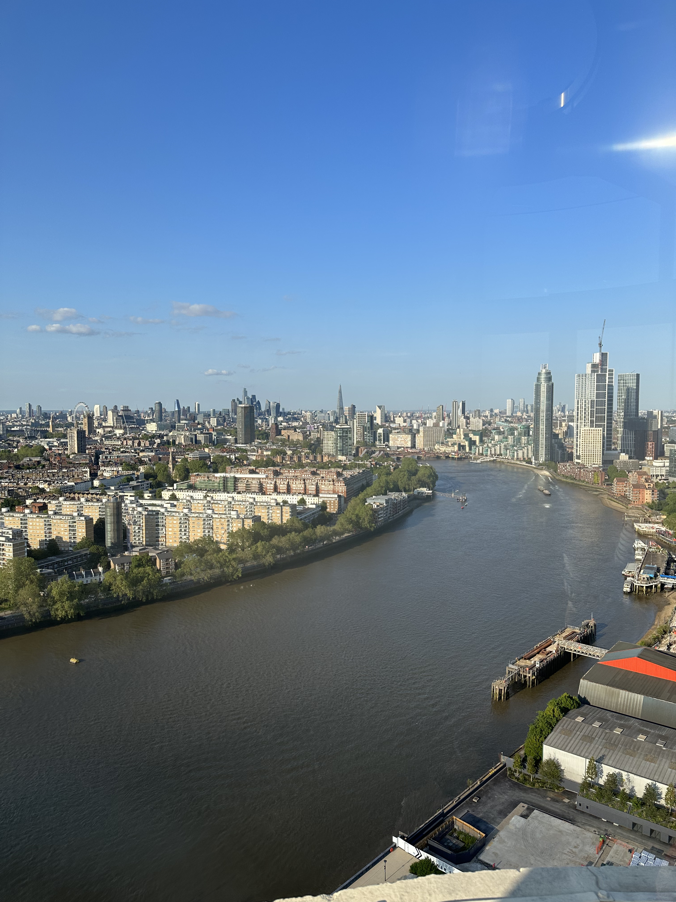

The view of sunny London on top of the Battersea Power Station.

_TL;DR;_

* Gym progress is just mad. Keto and ☕️ + 🏃🏻 work!
* Weekend in sunny London.

## Gym progress

Workouts are going spectacularly. I’m pushing daily, both in my cardio and weight-lifting session. I aim to burn 1k calories daily through exercise while I drink a triple espresso in pill form. Double workouts back to back are exhausting… I cannot imagine doing this for an extended period. It’s only temporary so I can eat as much as I want during the summer. So I’ll keep pushing. The results so far are promising. I did eat some Italian food over the weekend, so that was not planned, but what the hell? I’m not competing, and the food was Rome-level. So 🤷‍♂️.

## Weekend in sunny London ☀️

A fantastic sunny weekend in London. Sunny London is genuinely a different experience. People transform and are indeed full of joy. They say good morning, and they mean it!

Saturday, me my girlfriend and another couple visited Duck & Waffle for brunch. A very Instagramic restaurant on of London's skyscrapers. I really enjoyed the brunch 🦆🧇. Next, we walked around sunny London. For dinner, we went to Shoreditch at the Blues Kitchen. Live jazz music and decent BBQ-style food. I was drinking some 50 cal, low-alcohol beers 🍺, lol 😅.

Sunday, as always, is God's day. We headed for this little pub in Mayfair to watch the Spanish Grand Prix. Then we headed for the Battersea power station, where we learned about its history, got the Lift109, and headed for the top, where you can get a fantastic city view. Afterwards, we visited this fabulous Italian restaurant with unique decor and incredible authentic Italian dishes. I’ve had better Tiramisu in Italy, but the pasta and the pizza were excellent. It tops a lot of restaurants that I’ve been to in Italy. 
