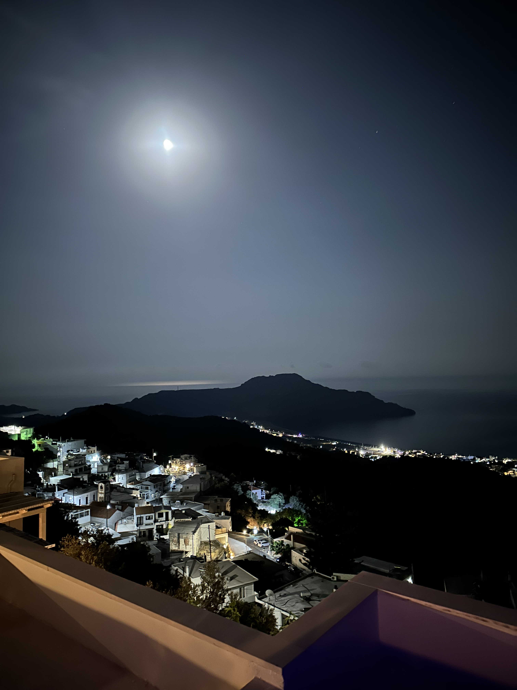

View of Plakias in South Rethymno!

_TL;DR;_

* WFH. Work from Heraklion 🏠.
* Do nothing holidays at Plakias with loads of food.
* HIT looks promising.

## WFH. Work from Heraklion 🏠

Back to work, working from Heraklion. For some reason, I'm way more productive in Heraklion, both at work and with personal stuff. It may be the change of location, or I am much happier here. My partner is here, and a lot of friends are here. It's a lot warmer and sunnier. What I'm trying to say is I'm Greek 🇬🇷😅. That's just how I am!

## Do nothing holidays at Myrthios with loads of food 🧇🍦🍝🥩

Every year, my partner and I go on holiday to some nice hotel with excellent amenities with a singular goal. Do nothing! Wake up, eat, chill, go to the beach, go to the pool, chill in the hot tub, drink some wine and enjoy the hot tub some more. That lasts for about 5 days. It's the most brilliant thing you can do! It's proper rest for the body and the soul. We were fortunate that we found a couple of great restaurants near us. I had the best moussaka I've had in one of those 😋. We also visited a nude bitch nearby, which was a first for me. A dude was sitting by himself, reading a book and pouring some hot tea for himself. If I had to bet, I'd say he's a Computer Science graduate. Things like that tend to happen to us 🤣.

Overall I had a fantastic time, and I feel refreshed and energized.

## HIT looks promising 🏋🏻

The Heavy Intensity Training protocol looks really promising. I've been reading up on it in my time in Myrthios. Mike Mentzer makes some sense. Although to be fair here, this is all anecdotal data. However, the training principles are sound. I'm going to give this style of training a try while I'm in Heraklion. It all boils down to whether you want to do enough work to trigger muscle growth and then rest enough for that growth to occur. It is exciting but counterintuitive compared to what I'm used to; the norm is high volume and frequent workouts. I'll arrange for a workout soon. It'll have to be personal training as this type of training requires someone to ensure you go all out and keep your form correct. At least initially, until I get used to it. Maybe later, I'll figure out a way to do it by myself.
Looking forward to my first session!
