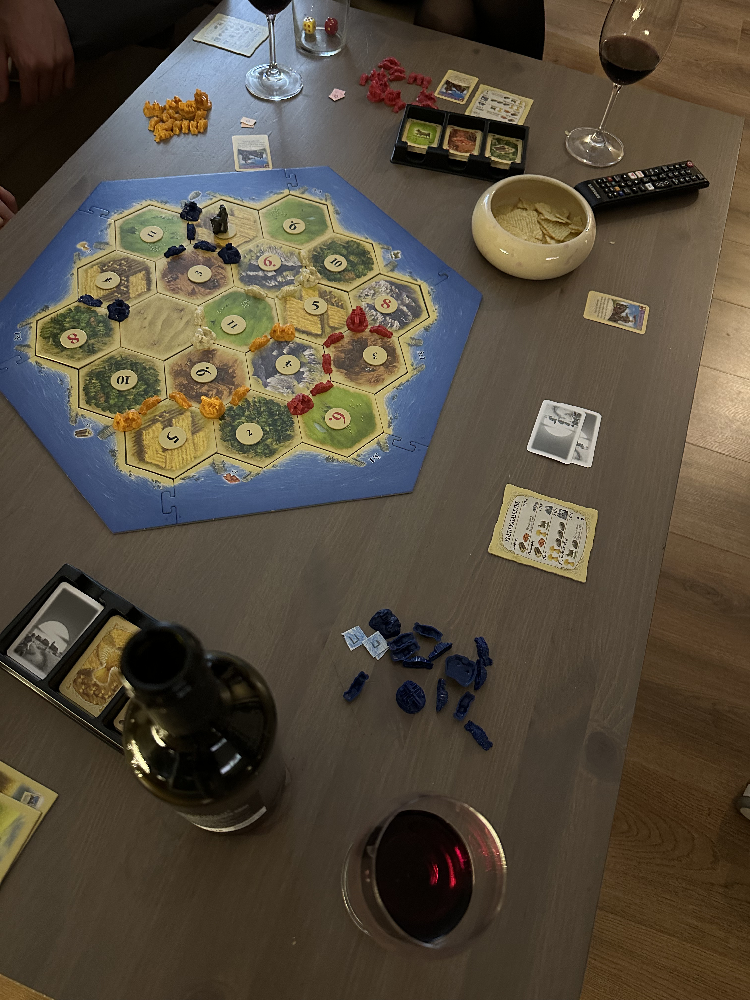

Playing Catan on Saturday night with friends.

_TL;DR;_

* Fast-paced week.
* Flew to Greece for a quick city break.

## Fast-paced week in London

The weekdays went by fast. I was back from Italy on Monday night, and before I knew it, I was packing my bags again to fly to Heraklion. Frankly, it was a last-minute thing. Work has been busy with the final preparations to launch the new app. So both new and legacy teams are busy with making preparations. I'll be slowly joining the new team in the coming week. Many challenges ahead for the new app.

## Weekend in Heraklion 🇬🇷

Hard to believe that the last time I was here was in October 2022. Time flies so quickly. This visit was unexpected as well. I didn't think I'd visit Heraklion before July. Still, I'm so glad I'm here. I missed my home, my friends and the sunny weather ☀️😎.

Saturday was an all-day out kinda day 😅. Breakfast, coffee, brunch, coffee again, lunch, coffee again and then dinner. At night, my friends and I took to the city centre streets with a guitar and just started playing and singing Greek songs. So much fun. And then, it was board game night! We played Catan till 3 o'clock in the morning. It's been ages since I've last been awake so late (man, I'm getting old).

Sunday was adventurous. There was the usual coffee and brunch afternoon. At 6 o'clock, we got into the car and drove to this little village mid-way between Heraklion and Rethymnon. It was 9 o clock at night, and we were wandering around a closed-off ancient ruins site. We used the stars and moon as a guiding light (and our phone's flashlights, of course, 🔦). It was beautiful and maybe unnecessary 😅. Later on, after all, this walking around, we found a local taverna where everything was made and cooked by this lovely grandma. Tasted delicious, like homemade food away from home.

Monday is the last night in Heraklion. I'm heading back to London tomorrow evening. Tonight is date night. I'll catch you in the next one 👋🏻.
