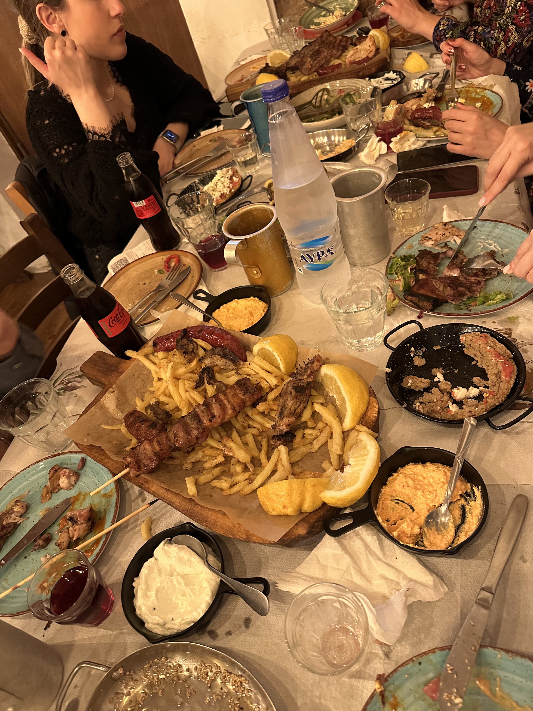

Birthday dinner. Mad amounts of food!

_TL;DR;_

* Diet and workouts out the window.
* Birthday celebrations.
* Weekend fun in London

## Diet and workouts out the window

Well. As I stated in the previous post, you can’t diet during Easter. Well… you can, but if you do, you annoy other people with your habits, and that’s just stupid if you’re not competing professionally. So what I’m doing is, making sure I keep my protein input high and also, I’m doing workout sessions when I can. Pull-up push-ups routine and morning walks is the name of the game. I did manage to squeeze in a leg workout at the gym on Tuesday evening. Working legs with weights and machines makes such a difference. Even though I’m back in London now, my schedule is still a bit off because I’m going on holiday again next week to Italy. The plan is to eat “keto” (although I can’t achieve the benefits of keto in just a week) and go for morning 60-minute walks every day to counteract the pizzas and tiramisus I’ll be having 😋.

## Birthday celebrations

It’s my birthday!! Tuesday night, I celebrated my birthday in Chalkida with many friends. We went to this lovely little taverna where the portions were significant, and the prices were, well.. like 2003. We all are and drank like royalties. I promised that I’d share what I got. I got a lovely blue shirt (I’m actually wearing it while writing this blog post). Casual fitting. Just great for everyday smart casual. I got a Friends illuminated signpost. I got it right by my desktop. It’s pretty cool cause it actually goes perfectly with my Friends cup. The last gift was a rather weird T-shirt. It had a gap in front of the upper chest, and the colour is like the one doctors or nurses wear when doing surgery. I gave it to my girlfriend. It looked good on her 😅.

## Weekend fun in London

I’ve been back in London since Thursday night. I’ve been knackered, so Friday night, I stayed in to rest. On Saturday, I met with two fellow Greeks. We walked around London for hours. I checked my watch, and we did more than 20km 🤯. We did have a lot to catch up on. They both shared excellent career news. One of them is moving to the US for a year. The other has a word for a possible stock listing of his company, where his shares have a massive payday potential. I wish them both every bit of luck.

It got me wondering about my own future. I’m trying a few stuff. If I do make it, I’ll share the recipe, I promise 😂.
