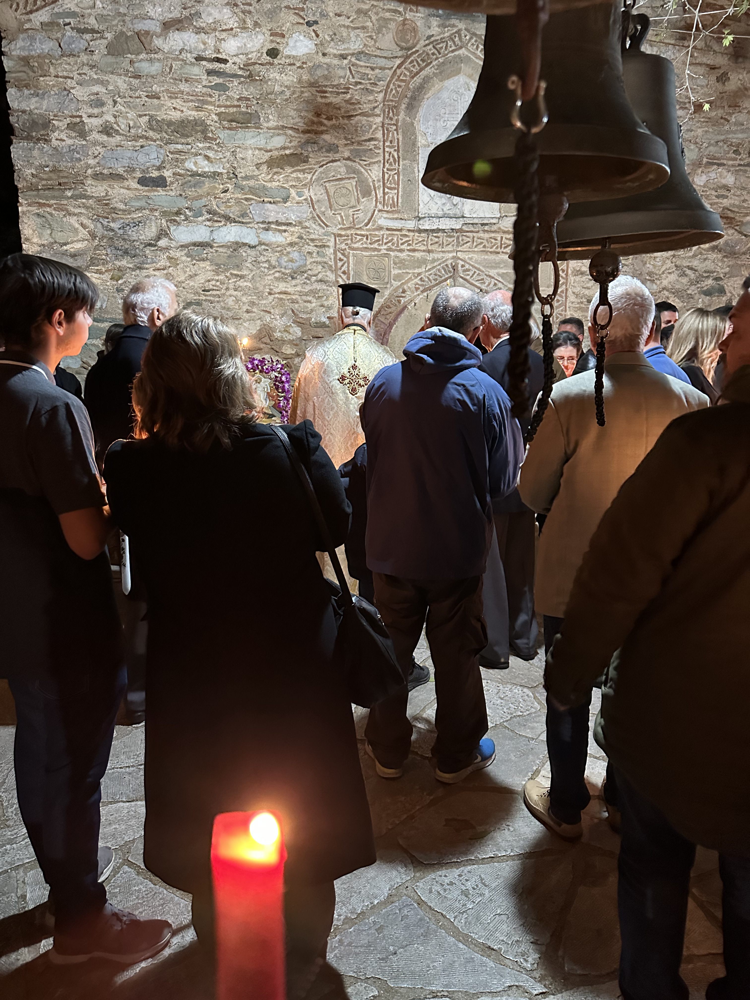

Easter time at a Greek monastery. So peaceful and quiet.

_TL;DR;_

* Usual work week.
* Keto is working. Can't sustain Keto during Easter 🐣, though 😅.
* Easter weekend.

## Usual workweek

Only a little to report here. Work has been moving at the usual steady pace. Most of the work has been delegated to the new team. I'm just helping out now and then. I also met up with two friends on Tuesday night and tried Persian dishes. They were delicious. Still prefer Greek 😛.

## Keto is working nicely ⚖️

Keto is working nicely. I can visibly see the progress, which is impressive, in such a short amount of time. Still, a long way to go till the 6 pack, though. I did some health tests, and my body fat is 17%. For the bulking season, it's pretty good. As I've mentioned, I'm not setting any specific goals for the summer. I wanna be as lean as possible without feeling like shit (like every natty).

Of course, Keto and proper diet are mostly thrown out the window during Easter. I still stick by it as much as possible, but limited access to the gym and the usual Christian diet rituals are getting in the way. Still, there's plenty of time to reach my diet goals.

## Easter weekend 🐣

I flew ✈️ to Greece on Thursday night. Rented a car and drove straight to Chalkida. I've worked out using body weight. I went for a couple of morning walks. Took off my T-shirt. Gotta get that Vitamin D; it was insufficient in my last blood test 😱.

Caught up with many friends over coffee. We went to this beautiful all-female monastery on Saturday night to celebrate Christ's resurrection. I saw my parents on Sunday, and we celebrated Easter together; It's been a while (February, I think).

See you next week, when I'll tell you what presents I received for my birthday 🎂.
