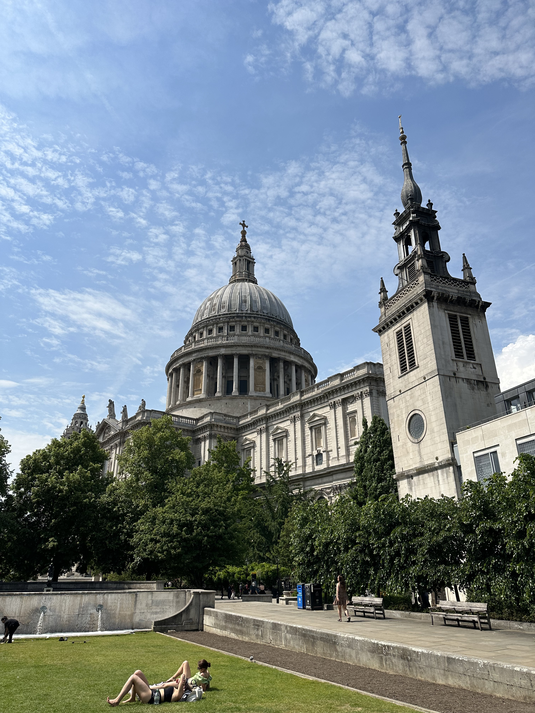

Beautiful shot of St. Paul's Cathedral.

_TL;DR;_

* Work is... tedious.
* My fat loss continues at a reduced rate. 2 weeks till Greece ⏲️.
* Weekend fun.

## Work is... boring

Only a little is going on at work. As mentioned in the previous post, I've joined my old team. Don't get me wrong, there is stuff to do, but it's just I've done this over and over again. In this company, in the previous company. I'm at a point where I need some change. A new challenge, perhaps. I'm still searching as to what this might be.

## Diet & gym 💪🏻

I'm still going hard in this area. The weekdays are really tough. I work out a lot, and I mean a lot! By the end of the week, I'm exhausted. Still, I'm going to stand by it. It's just 2 weeks left till I go to Greece for a holiday at this point. After that, I'm switching to a different workout/diet mentality altogether. I'll enjoy dining out most days and limiting my lifting days to just 3. I plan on making them brutal, though, so rest and proper nutrition will be necessary.

## Weekend fun

On Fridays, we've got half days from work. A pretty lovely benefit, mainly cause it's summer 🍦.

I took advantage of a discount from work and got the chance to watch Harry Potter and the cursed child. Absolutely loved it. I recommend everybody to watch it. There are so many special effects happening on stage, like real-life magic. It blew my mind. A unique experience for sure.

Saturday got my workouts in and then joined the boys at a pub near the Thames. We walked around London. It was so damn hot, upwards of 31 degrees. Shorts were a must!

Sunday was race weekend 🤥. No, it wasn't! But I visited F1 Arcade, and it was awesome. The sims there are the real thing. Porpoising and everything... I initially tried the "noob" mode, but it was too forgiving and meddling. Ultimately, I played "Elite", which offered no help. Still, it was by far the most enjoyable and realistic. So good! Then straight to Canary Wharf to sit on the grass and watch the Roland Garros final.

When the weather is good in London, it's a totally different experience 🇬🇧☀️!
