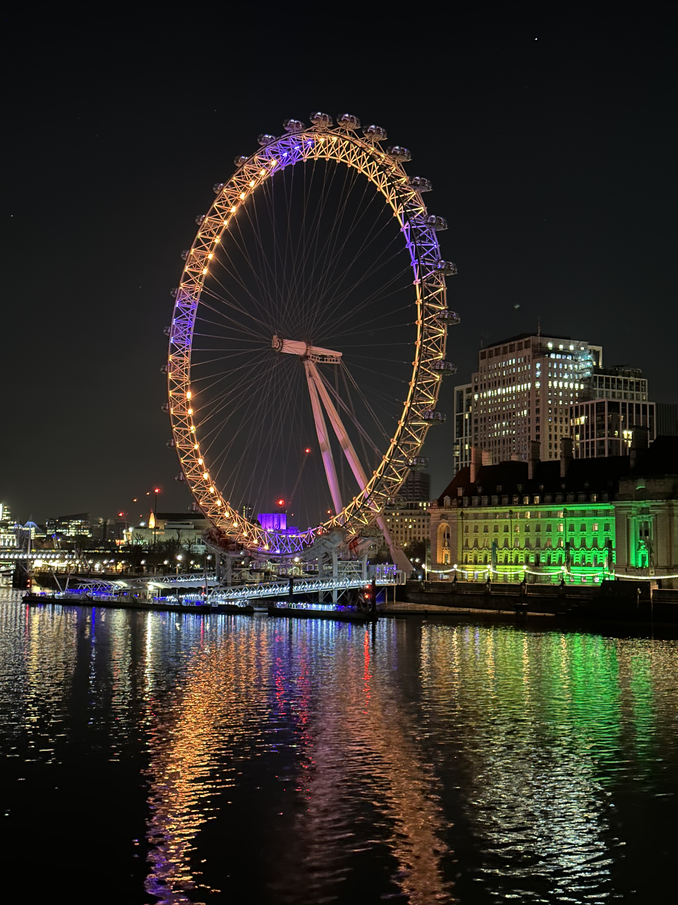

London Eye, on a Friday night after drinks!

_TL;DR;_

* Blogging hiatus. I've not been up to much.
* Gym continuing. I've started my cut.
* Work has gone down to the normal working rhythm again.
* Fun weekend. Caught up with friends all 3 days.

## Blogging hiatus

The last time I blogged was 2 weeks ago. There's not been much to say. It's just been the usual work routine, gym, and sometimes going out. This time isn't any different 😅, but I thought I shouldn't skip this.

## Gym 💪🏻

Happy to report that bulking season is over. I made a little bit of progress compared to last year. To be fair to myself, I've been bulking for the previous 4 months. I wasn't pushing as much the months before that. So given this timeframe, I'm happy with the results. Even when I had a dedicated coach, the progress was the same. So that's a win in my book.

I've officially entered the cutting phase. Already doing a keto diet. I'm feeling good so far. Still, feel like I've got the energy to work out and the energy to "live life". I've bumped up the water intake as well as the salt. I'm keeping the caloric deficit small for now, at 10%. I may keep it like that, depending on how it goes in the next 2-3 weeks.

The plan is to reach a good, low-fat physique by the end of June. Plenty of time.

## Work ⛵️

Work has reverted back to the previous rhythm. There are still a few issues that I have to jump in and help with, but mainly, I've been reviewing PRs and doing knowledge transfer sessions for the new team. I plan to join my old team working on the new project soon.

## Weekend fun

This has been a fun weekend. The weather has been fantastic by London standards. Plenty of sun. You needed a T-Shrit on Sunday 😮.

On Fright afternoon, strolling around sunny London enjoying the sun. At night, drinks at this lovely bar with an exceptional cocktail menu. The menu was called "Duality". On a page, for example, it would feature 2 cocktails. The "Sun" and the "Moon", the "Past" and the "Future".

On Saturday, I caught up with a friend from my old workplace. It's been a while. We chilled and discussed the usual; Markets and ideas, and also I played the new Harry Potter game (which I bought him for his birthday 😊) for 10 minutes. Sick graphics and fantastic gameplay. Good job, Warner.

On Sunday, back with Greek friends, we went to Hampstead Heath. It's a prevalent spot for Londoners to enjoy a sunny day with the city as a view.

I'll catch you on the next one with probably some fun story about Easter.
