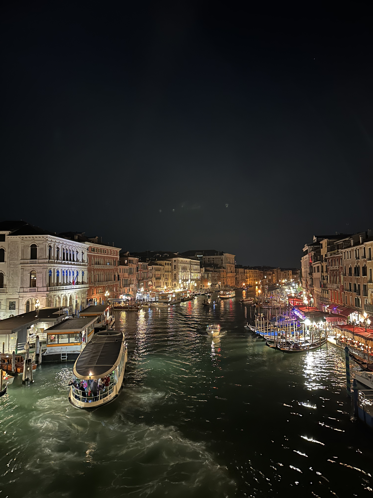

Venice during the night. Like a painting!

_TL;DR;_

* Diet and workouts before and during Italy.
* Italy was rad + unexpected meet.
* Electric car experience.
* Next bank holiday weekend in Greece

## Diet and workouts before and during Italy.

I've been doing what I can regarding the workouts and diet to prepare for Italy. I've managed to work the entire body once, and I've been doing Daily 60-minute morning brisk walks. In my time in Italy, I really haven't had any time to work out. Absolutely 0 downtime between our activities. We have been out walking, exploring and eating everything in sight. I'm still young. If I don't eat all the tiramisu, my belly can fit now; when will I do it? At 60? No, thanks.

## Italy was rad 🇮🇹🍕🍰🍦

We had a fantastic time in Italy. It was five of us. We visited Milan on the first day, Lake Como and back to Milan for the second day and then off to Venice for the 3rd and 4th days.

From my recent experience, Rome wins first place for incredibly delicious food. Milan could have been better. We did get to eat a delightful tiramisu 🍰 at a high-end restaurant, deconstructed with ice cream; terrific! The best pizza 🍕 was in Venice! We had one each. We tried them all, but I particularly liked the one with different kinds of cheese. Best ice cream 🍦 from this little place in Milan; The pistachio flavour was just incredible; really well-made ice cream.

We did some sightseeing in Milan. Went on the roof of Duomo; saw it both night and day. Went to the Navigli neighbourhood, where most of the city's nightlife is. All in all, like Rome, it felt really familiar to me, like Athens. Between Rome and Milan, I prefer Rome hands down 💯.

We also visited Lake Como. I guess that's where all the rich folks hang out during the lovely weather days 😅. I can see why. It was majestic. We went up to Bellagio. It was jam-packed up there. In terms of food, we didn't find anything worth eating. Anything that we tried left us disappointed.

Venice was fantastic. The pictures don't do it justice. As soon as I saw the first canal, I just smiled. I don't remember the last time I was so happy from looking at a place. Truly beautiful, as you can see from the picture at the top. I'm gonna revisit Venice for sure. Great food, little alleys that you can get lost in (Google works, so you don't need to if you don't want to 😅), gondolas (yes, we had a gondola ride) and amazing scapes. We visited the palace; it looked similar to other structures I've seen in Rome. Golden surfaces, painted walls and ceilings. Fit for a ruler! 99% of the houses were old structures that were renovated inside. Kinda scary. I'm not sure if they get earthquakes often there, but I wouldn't want to be there for one. I spent only one night there so you can see why I want to visit again. I could easily spend 2 months living in Venice, just exploring the alleys and the canals. It's quite a vast place. Before leaving, the last thing I had fun with was how I got to the airport. By a small ferry! Yes, I went to the airport ✈️ by ferry ⛴️ 😁.

Something totally unexpected happened. A close friend of mine from Uni, who I hadn't seen in years, was visiting a friend in Zurich, Switzerland. He saw my Instagram stories and immediately messaged me, saying he was heading for Milan; he started early in the morning with his friends. We didn't plan this! And then, there we were. Having drinks at a bar by the canal in Milan. Moments like these feel incredible. The world is just a wonderful place.

If I had to choose 1 thing out of the whole journey that I enjoyed the most, uh... I can't. It'd have to be 2! The moment I saw how beautiful Venice is and smiled uncontrollably, and the moment I was eating that slice of pizza full of cheese while drinking some outstanding wine🍷! Pure foodgasm 😋!

## Electric car rant 🔋🚗

We had a car to drive around. We rented the Polestar 2 for extra room, plus the luggage. It was my first time driving an electric vehicle. They are speedy and responsive. This one also had an advanced driver's assistant. On the motorway, it accomplished lane keeping, braking, and acceleration. It was great. There were a couple of moments where the turns weren't smooth enough, but overall handy functionality.

Now for the bad stuff. It really was a pain to charge this thing. So inconvenient.
- First, it'll cost you if you want to use a fast charger. Even if you use a slow one, it costs plenty.
- Second, whatever you're doing at that moment, you need to drop everything and go and move your vehicle if it's charged; otherwise, it will start charging you a lot of money. Sure, that's reasonable, but it's a problem ICE vehicles don't have.
- Third, you need to plan your day and travel carefully. Plan ahead if you must be at a specific destination with a certain battery capacity.
- Fourth and most serious, the whole point of electric vehicles is that you'll be saving money from gas. That was different from my experience. I paid a ton of money for charging it. I spent exactly the same amount of money I would spend on gas. You cannot save money like this. The only case where I can see you saving money is from charging it at your house. But, and this is a big but, you need to own a home (no landlord, especially in Greece, will ever install a plug for you). In addition, electricity prices are rising and are expected to go higher. For me, an electric car purchase in Greece is years and years away (even though the government is funding 8k€ of the purchase price).

So, all in all, it's not for me!

## Next bank holiday weekend in Greece

I really am hopeless this year with the diet 😅. I'll be in Greece next weekend as there's another Bank holiday due to the King's coronation. I'll try and work out as much as possible and eat full Keto. There's no more room for playing around if I wanna reach my end-of-June goal. Real life quickly gets in the way of being in a ripped physique. But again, I don't mind it. I'm not competing. I want to enjoy my life and feel good. I'll catch you on the next one 👋🏻.
