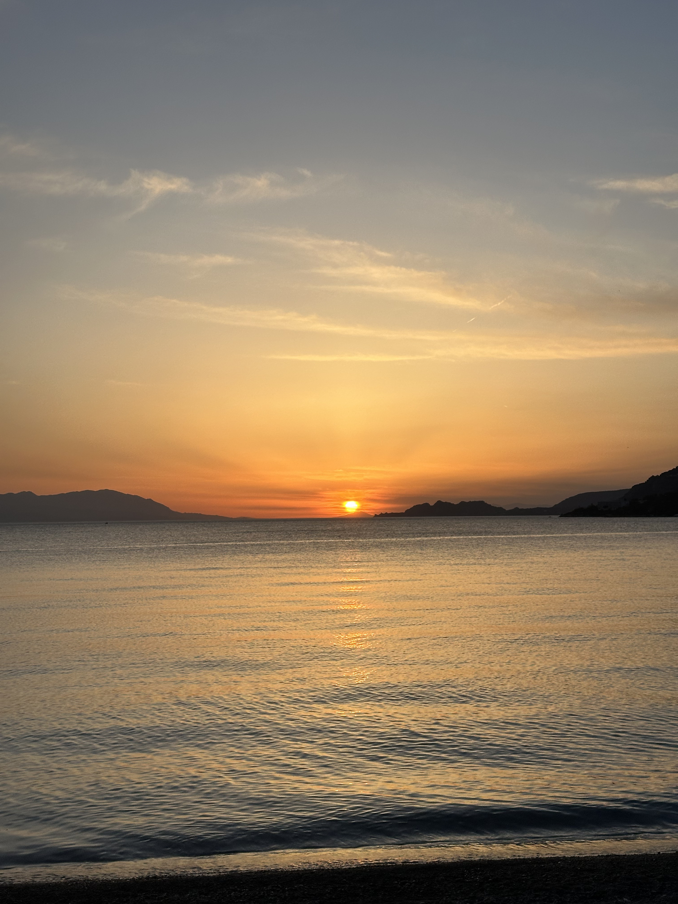

Sunset in Greece, Loutraki 

_TL;DR;_

* New blog purpose; only worthwhile updates from now on.
* I started a thing; We got our first paying customer.
* Not been in the gym for the past 5 months.

## Blog purpose

It's interesting to note that this post was published at the location where I initially started this blog. There will be a noticeable shift in how frequently I write here. Moving forward, I intend to post less often but with more substance. Previously, I shared about weekend trips, food, gym sessions—everyday occurrences. While I enjoy writing about those topics, that wasn't the original intent of this blog. I envisioned it as a platform for more significant reflections and updates.

## I started a thing

Regarding noteworthy updates, a friend and I have launched an online service (details to come later). The big news is that we recently secured our first paying customer 🎉! Now, we're working on landing our second. Once we hit ten paying customers, I'll share more details. For now, customer acquisition occurs through social media channels—Facebook groups, Reddit posts, etc. Our SEO is solid, optimizing us for relevant searches, though it's still in the early days for high rankings. I plan to create more content and cross-post where potential customers will likely find us to boost traffic. I'll delve into the business specifics in a future post. The key takeaway is that I'm keeping things simple and avoiding the urge to over-engineer features that users might not need or use.

## Life update

For those who know me, it's no secret that I've been dealing with some health issues, which have kept me away from the gym for five months now 😱! This is highly unusual for me. I have another check-up scheduled soon, and I'm hopeful the doctor will give me the green light to resume my workouts 🤞🏻.
