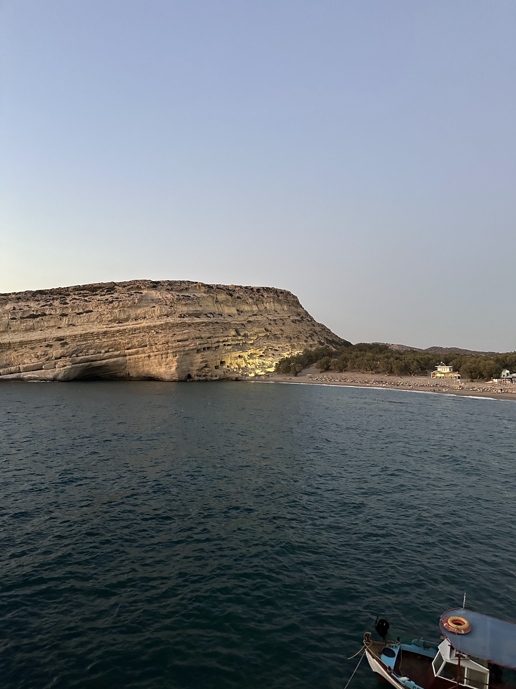
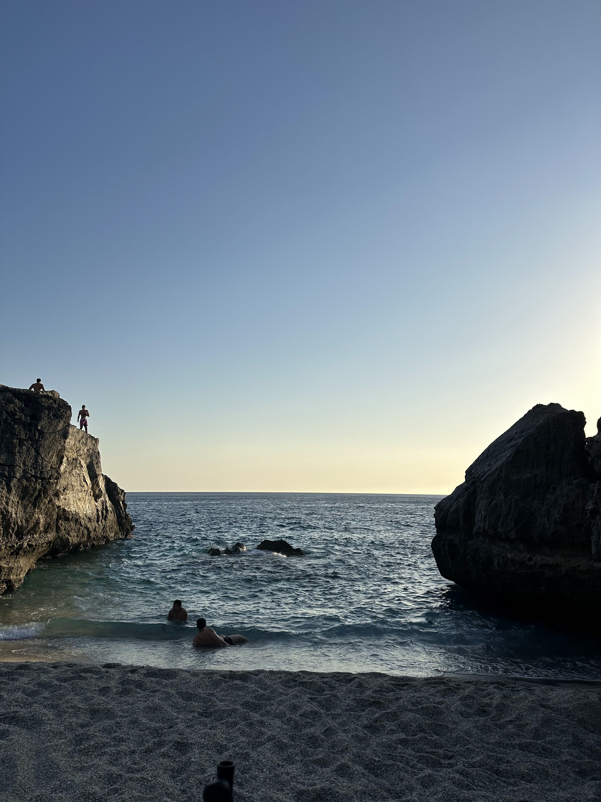
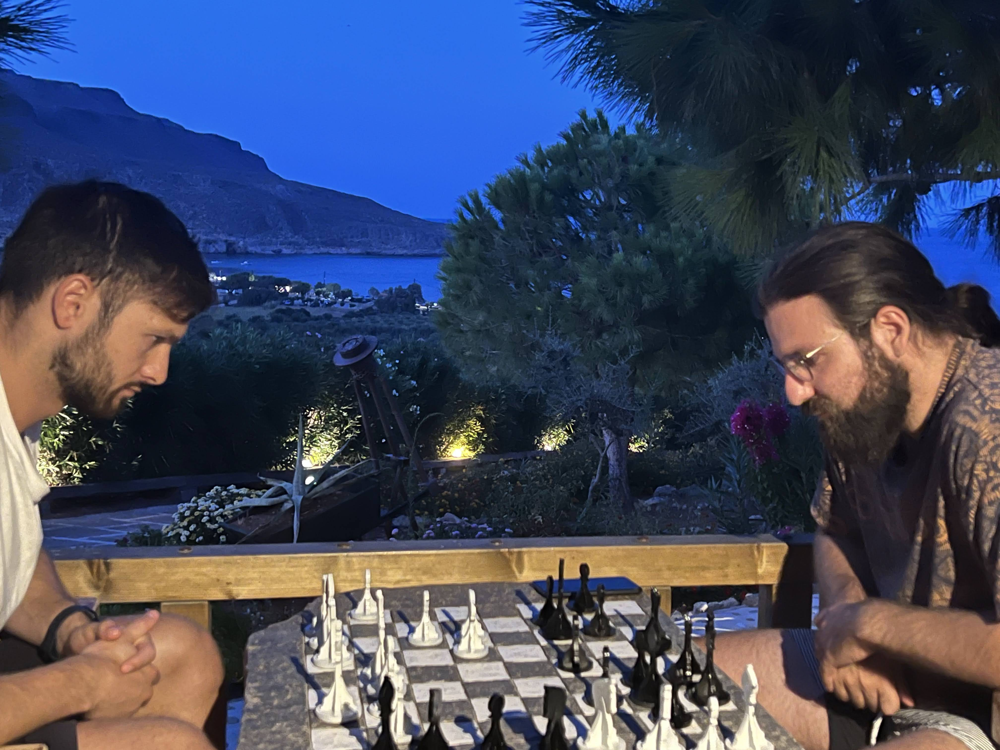

## Summer fun

I've not blogged this month a lot. There hasn't been any significant life event. I've been enjoying every day in Greece.

Instead of writing a bunch of words, I'll condense this down to a few pictures.

August 15th at Matala.

Ammoudi (mostly) nude beach.

Chess with a view.

"End of summer" concert.

Prepping for a sucba night dive.

Lovely wedding chappel by the beach.

## What's next?

I've promised myself that by Christmas, I'll have figured out what I want to do with my life and a way for me to be free to be where I wanna be: Greece, in my case. So that's going to be my number one priority.

The second priority is health. I want to make sure I'm eating right all the time. I'll be hitting the gym twice weekly and going for a morning run 2-3 times a week. I'll also get several tests. I'm 32 now, so I need to start being careful.
