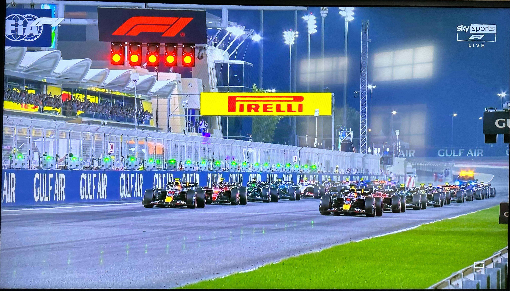

F1 lights out @ Bahrain Grand Prix

_TL;DR;_

* Social presence refreshed.
* Gym 🔥.
* Weekend fun.

## Social presence

I finally finished with my social stuff. Refreshed my LinkedIn and the rest of my online social presence. Honestly, this took weeks. I really didn't want to do it. And I had an excellent base to start, with most of my profiles already in a good state. Imagine if I was starting from 0 😱. Still, now that this "chore" is out of the way, I want to focus on more important things. One is more of a chore, but it must make particular arrangements now to take care of future Kostas. The second is more of a pet project of mine. Not gonna go into more details 😊.

## Gym 🔝🔥

4 days have passed, and my legs are still on fire 🔥. I'm feeling good; I'm increasing the weights to my lifts. Very, very happy with my progress & results so far. Let's go 💪🏻.

## Fun Saturday & Sunday

Classic Saturday catch-up with greek friends. Sunday, also caught up over coffee with a friend from my old workplace. And last but not least, it's lights out 🚥 and away we go 🏎️!! So excited about the F1 season this year. Although it looks gloomy for everyone but red bull. Man, they're fast right now. Let's hope Merc can catch them.
