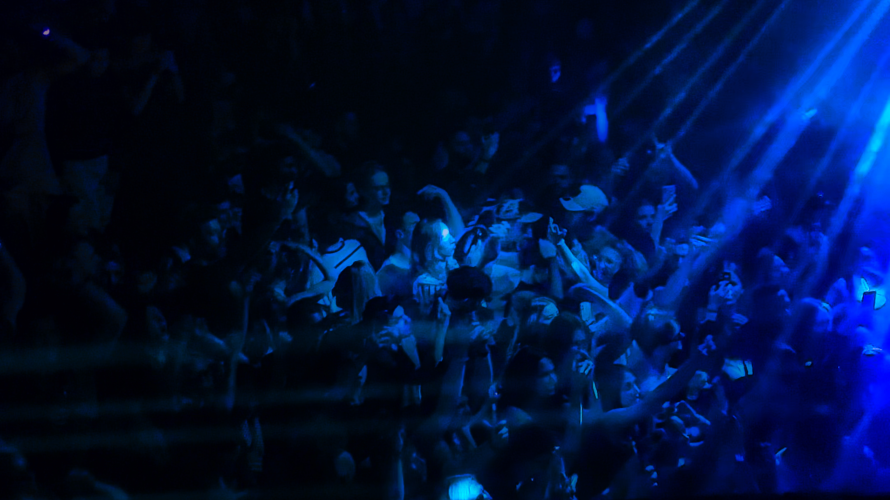

Gorgon City at Fabric

_TL;DR;_

* Been catching up on web3 tech. It's... interesting.
* Started working out with weights again.
* Football game 🏴󠁧󠁢󠁥󠁮󠁧󠁿.
* Sunday night.

## ⛓️ Web3 looks... interesting

I've been experimenting with web3. I've looked into how the BTC protocol works and now getting into ETH. There are many valuable things one can build with such tools. The blockchain is already revolutionizing so many sectors. I'm not late to the web3 industry. This is the 2000 bubble for crypto projects. The genuinely revolutionary products will reveal themselves after this financial hiccup.

## Training with weights again 🏋🏻

The past week I've carried on with a couple more morning sessions of shadow-boxing 🥊. Not every day. I mix it up with a brisk walk in the park when it's not raining. After all, this is London; you gotta take every chance you get for a bit of sun and fresh air.

What's new is that I've finally got my home gym equipment all sorted. Heavy dumbbells and a bench. For now, I'm pleased with the intensity. I'll keep going 💪🏻.

## England vs. Senegal 3-0

On Sunday evening, I caught up with a friend, grabbed a burger and a drink at a lovely pub in west London, and watched the world cup game. He's also in the tech industry, so you can imagine that most of the time, the conversation turns a bit geeky 🤓.

## Welcome to Gorgon city 🎵

The pic at the top says it all. It was a fantastic night! I've been wanting to listen to these guys for years! Every time they're in London, the venue sells out in minutes. So hard to get tickets. There are so many sets of theirs on youtube. Definitely recommended if you're into this type of music.
