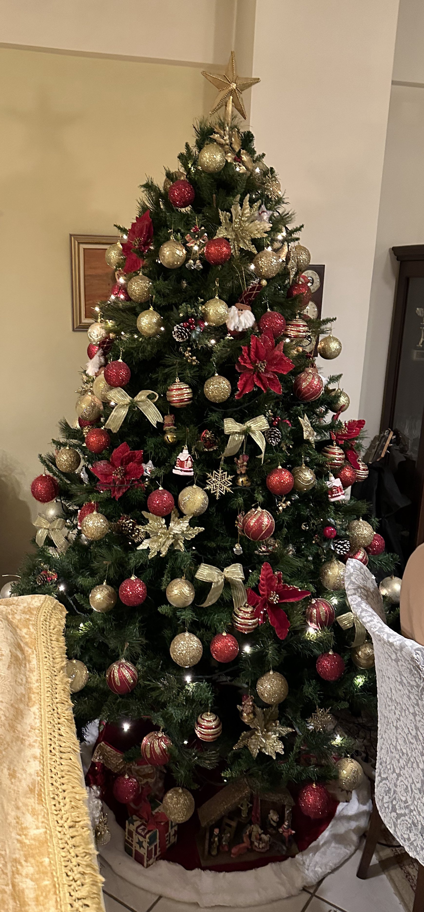

The Dimakis family Christmas tree

_TD;DR;_

* Not many exciting things happened
* Finally, in Greece for Christmas
* Christmas trees

## Busy week full of chores, 0 productivity

In preparation for my upcoming trip to Greece, the whole week was chore-heavy. I only got a little time to continue studying web3 this week. Nevertheless, I'll continue progressing now that I'm back and in a more stable routine. Last stretch till time off. Let's goooo.

## Christmas in Greece 🎅

The temperature here is just ridiculous. Mid-December, and it's 20 degrees. Plenty of south winds, that's why. The past week in London, it's been below 0 mostly. Still, every single day was sunny. Freezing cold but sunny. So I got to go to the park every day. On Friday, I stayed at home and did some shadowboxing as well. Other than that, the usual. Seeing parents, girlfriend, and friends. Excited to be here for Christmas ☃️. Ooh, if it snows, I'll also get to go snowboarding 🏂. Really looking forward to that.

## Christmas trees 🎄

The first thing I did when I got home was snap a picture of our beautiful Christmas tree. My mom always does a fantastic job decorating it. On Sunday night, I visited a couple of friends and had a lovely evening decorating the Christmas tree. And probably Monday night, I'll be decorating another one! Yep, I'm a sucker for Christmas.
