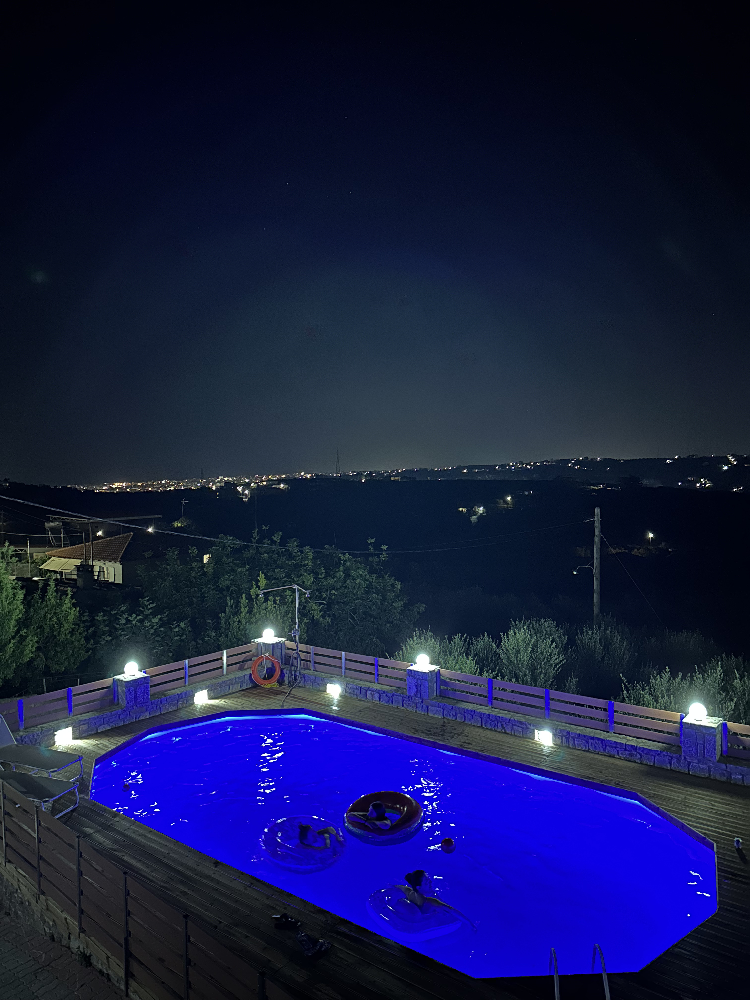

Work hard, play hard!

_TL;DR;_

* First PT session 🏋🏻.
* Party all weekend long 🎉.

## First PT session 🏋🏻

I've been working out with weights or practising some sport FOREVER. I've always been active. I may have rarely taken an occasional break, but I've always been active. However, I've never ever had a personal training session. Mostly because I didn't need it. I know what I'm doing.

So why is this time different? Well, it's all thanks to the High-Intensity Training protocol. I've decided to experiment with this for the summer months in Greece. The protocol says you must go all out for a few sets. So why I can't do it alone? Cause my form will be breaking down as I max out, and cause I'll probably be giving up too soon as this is my first time doing this type of training. My PT, George, is also curious whether this training program will work out. However, he's kept an open mind and is playing along for now; I thank him for that. Very professional.

Training to failure on all exercises really is a different beast. I'll learn to push to the limits without help in order to carry on with this type of training when I'm back in London.

## Party all weekend long 🎉

Oh man, this has been a crazy weekend. A friend had his birthday. He rented a whole villa with a pool for us. I'm not gonna lie; that's an excellent way to live. But I don't know; I'd still want some adventure. I want the _play hard_ with the _work hard_. You don't appreciate it the same.

We also had a paintball session 🔫🎨. Led my team to victory 🤣. Everyone loved it! We're going again next month ✌🏻.
