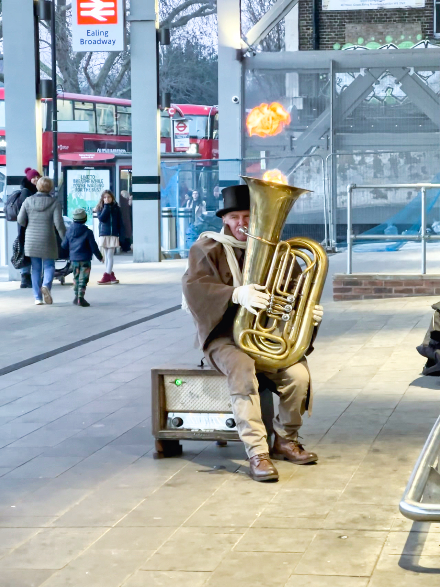

A wonderful man, playing the euphonium that spits out fire !

_TL;DR;_

* Quiet-ish week.
* Getting used to the workouts.
* Movie Sunday.

## Quiet-ish week

A little to report on this one. It's been another quiet week. That's how my time in London usually passes. On Thursday, I did attend a Meetup where e-commerce founders of British companies were giving some talks on what it takes to be in the e-commerce business, how the space is right now and advice on the challenges they've faced. Useful overall. It confirms the idea that e-commerce is a sector where there's usually plenty of money and plenty of opportunities to offer services to businesses.

## Workouts going well 💪🏻

Workouts are still going on strong. I'm getting used to how rigorous they are. But still, I go for progressive overload in every single session. This was week 2 of 5 on this program. Still got plenty of gains to make. I've increased my caloric intake from the previous week. It actually helped a lot. I gained some weight compared to the last weigh-in, which is excellent news. That's what you want; you're going for that lean bulk.

## Sunday, movie night

I've been wanting to watch Babylon. Ever since I saw the trailer. What a terrific movie. I gave it a 9/10 on IMDb. It had it all. It was a depiction of the ugly, the bad and the good of Hollywood. It was also long 😅; 3 hours.
