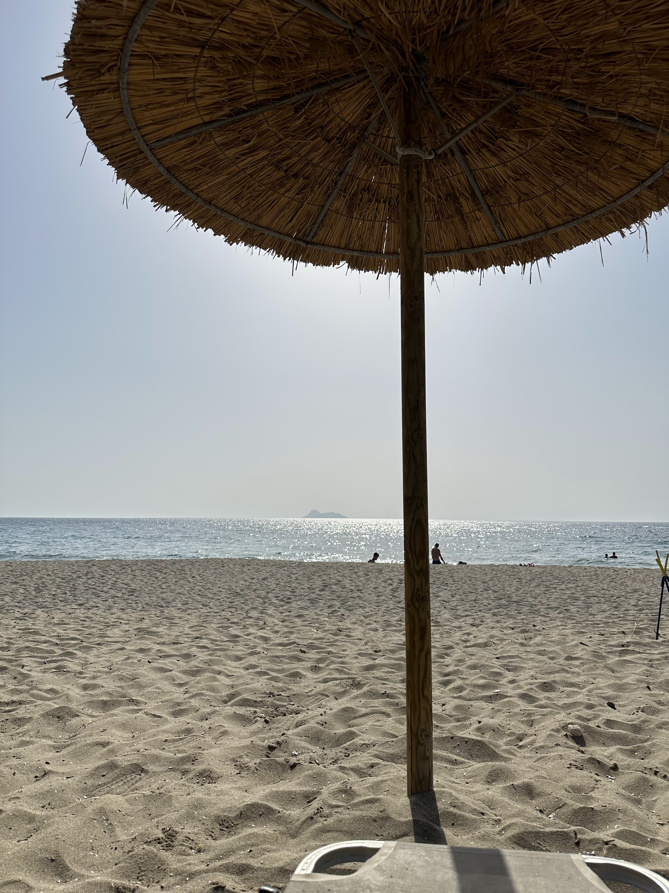

Kommos beach, south Heraklion. Beautiful spot! Temperature at 40°C 🥵.

_TL;DR;_

* Second PT session. Legs 🦵🏻. Eating like a bear.
* Coping with the heatwave 🥵.

## Second PT session 🏋🏻

The gym is going really well. This type of training was really needed. The space between the workouts really gives me time to recharge. I'm still determining what type of results I will get; I'll judge them by continuous improvement in strength and an overview of the overall progress by the time I do 3 full circles on the program. Right now, I'm only half a cycle in. For now, I'm enjoying the schedule that allows me to work hard and rest many days to enjoy the summer.

I am currently eating like a bear. However, I'm not noticing an increase in weight which for many would be desirable, but not for me. I'm cutting back on cardio for the next week to see how this adjustment will impact my weight gain.

## Coping with the heatwave 🥵

An incredible heatwave has hit Greece since Friday. Though this happens every summer in Greece, it seems to also impact the wider Europe this time. I can practically "see" the future climate protests unfolding.

So, weekend heatwave! What do you do? Two viable options. Sit at home with the air con and chill, or go to the beach like a brave piece of meat ready to get crisp. Both options are Greek Approved ™.

## Weekend

The weekend started with a visit to this nice Greek tavern in Archanes on Friday evening. Lovely Cretan dishes. It's a regular one for us. Consistent quality and fresh produce every time. 5 ⭐️. After that we went to this really chill-vibes bar-restaurant, again near Heraklion. It's right on the beach; it got beautiful bean bags for you to lie and try not to fall asleep 💤.

After a quick pancake breakfast on Saturday, we headed for the beach. We visited Kommos Beach in southern Heraklion. There's a fun fact for this story, actually. We didn't know which beach we'll visit that day. We just wanted to have dinner at this one tavern called Aloni. Cretan cuisine at its best. We were 7 people, and we feasted like heroes, having survived the heatwave of that day. The tavern is called Aloni; 5 ⭐️.

On Sunday, continuing the trend, we knew we wanted to visit this little Cretan village called Kritsa, one of the oldest in Crete. We first visited a nearby beach, Voulisma. It's a well-known one with lots of people, but still worth the visit. Kritsa was really idyllic and beautiful. Had a lot of traditional shops with lots of handmade stuff, from garments to ceramics etc. We also visited their lovely museum, which had an unparalleled selection of herbs. The lovely gentleman catering for the museum explained where all these herbs are used, their remedies etc. After the tour, tea was served using some of the mentioned herbs 🫖😌. There were so many that I hadn't even heard of before. I immediately sent a message to a Cretan chef friend to visit this incredible museum. It's a must! We were lucky to find another excellent tavern near us after that. Yes, we're all foodies 😋.

See you on the next one! 😎
