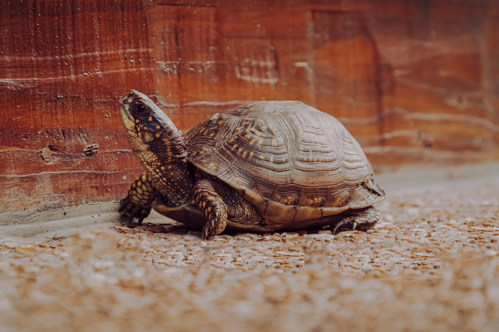

    A sloooow turtle 
    Photo by <a href="https://unsplash.com/@ralphkayden?utm_source=unsplash&utm_medium=referral&utm_content=creditCopyText">Ralph (Ravi) Kayden</a> on <a href="https://unsplash.com/s/photos/turtle?utm_source=unsplash&utm_medium=referral&utm_content=creditCopyText">Unsplash</a>

_TL;DR;_

Part of my routine is back. Still need to put in more effort towards my goals instead of chores.

## Get back to work/workout routine

Well, I think this is going alright so far. I still don't have my dumbbells though. But still so far, I've been working out daily along with my cardio and sticking to my diet like normal. What I want to improve is, make my morning a little bit more productive. I think starting tomorrow I'll stick with no touching the phone, no emails etc. I think that'll give me some time to work on my actual goals, which in this case means the second "fitness workflow" plan.

So, no phone/emails when I wake up but instead straight to work! Let's see if I can manage it.

## "fitness workflow"

I'm making very slow progress on this one. I've got a ton of stuff left to do. I think the main structual pillars are there but now there's 2 things left.

* Distill the essence of my notes to the actual spreadsheet and incorporate it.
* Produce 2-3 example diets to see that everything is alright.

_I need to do this plan for both the "bulking" phase and the "cutting" phase_. I don't want to be spending time on this again.

## Roam around London when free

Literally have not left the house! 😅

Don't get me wrong, I've done many many chores, that just had to be done. I haven't been sitting and watching movies. I just need to focus on completing the list for now.

Alright! So

* work harder on the "fitness workflow" and
* try to squeeze more time in the morning as well.

Check-in next Sunday. Until then stay awesome 😎. Peace ✌🏻.
