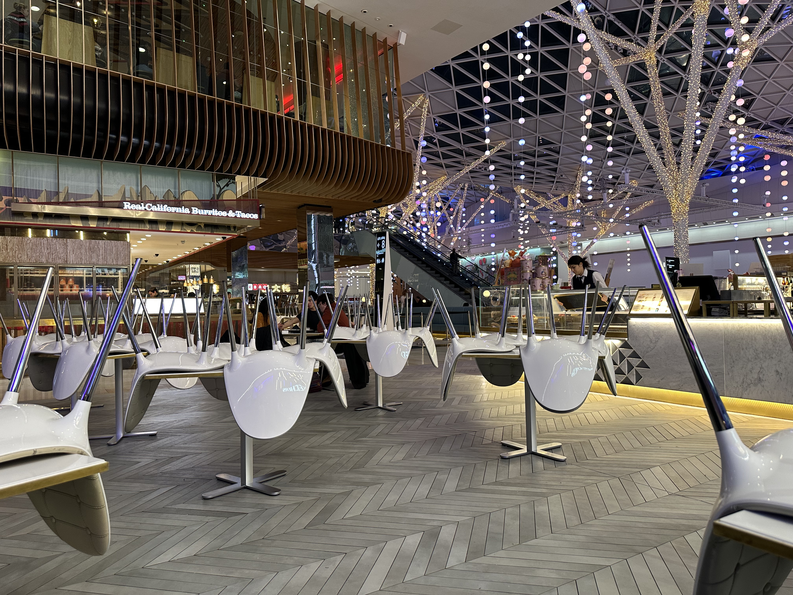

Westfield closing while I'm waiting to watch a movie

_TD;DR;_

* Finally, first blog post; let's hope I'll keep going.
* Relaxing Sunday.
* I'll be blogging about the past week.
* I'm a foodie.
* Watched The Menu.

## First blog post 🎉

Hello there. This is my first blog post, so welcome! Been wanted to do this for a while. Kept postponing it, wrote drafts that I never published, etc. There's a high chance that you've been there as well. At least this one is published. Let's see how long this is going to last 😅.

## Relaxing Sunday.

Sunday is always a chill day 🧘🏻. Woke up and did a bit of cardio. I did shadow boxing 🥊 after a long, long time. I'm definitely sticking to that for a while. I miss it like crazy. Then breakfast and a few house chores and out for the day. Grabbed some coffee and walked around my neighborhood for a bit. I'm sitting at Westfield writing this blog post and waiting to watch [The Menu](https://www.imdb.com/title/tt9764362/). I am a foodie, so I'm sure I'll like it 🍲. I'll let you know what I think below 👇🏻.

## Sunday posts about the past week

When I initially wanted to start a blog, I wanted to make it like a public TODO list to help me keep myself accountable. That failed miserably. I must have written 3 blog posts, all in draft mode.

So now I want to take a new approach. I'll write a post every Sunday evening about the past week. It'll make me write down my thoughts, review the week, and how I want to proceed. It'll also make me better at writing. That's very important as well.

## I'm a foodie 😋

Let me explain why I'm a foodie. I always enjoyed good food but never had a fine dining experience. In August, while in Athens, I visited a 1 star Michelin restaurant. Simply put, it was the best meal/experience I've had at a restaurant. The food was delightful. And it wasn't just a few courses back to back. It indeed was a story. Every meal was delicious and was preparing you for the next one. The wine pairing took the whole experience to the next level. A truly unforgettable experience. The restaurant is [CTC](https://www.instagram.com/ctcresto) for anyone interested 😉. Since then, I've been looking for good quality food, from famed restaurants to city centers to remote villages offering outstanding locally sourced cuisine.

A side note. A lot of people are going to think that fine dining is really _a lot of money for no reason_. _An unnecessary expense_. _And the portions are tiny_!

The answer to that is straightforward. It's not just a meal. You're getting an experience. A very memorable experience. It would be best to compare it to a good seat at a west-end theatre or musical. Or even a weekend trip. Cause that's what it is. An **experience**. And trust me, by the time I was done at CTC, I was full. The right amount of full. Feeling great, but also not wanting another bite even if you paid me.

## The Menu

BRB. *Watches the movie*.
And I'm back! As I expected, I will have to make reservations at a nice restaurant in Athens during the Christmas period 😂.
