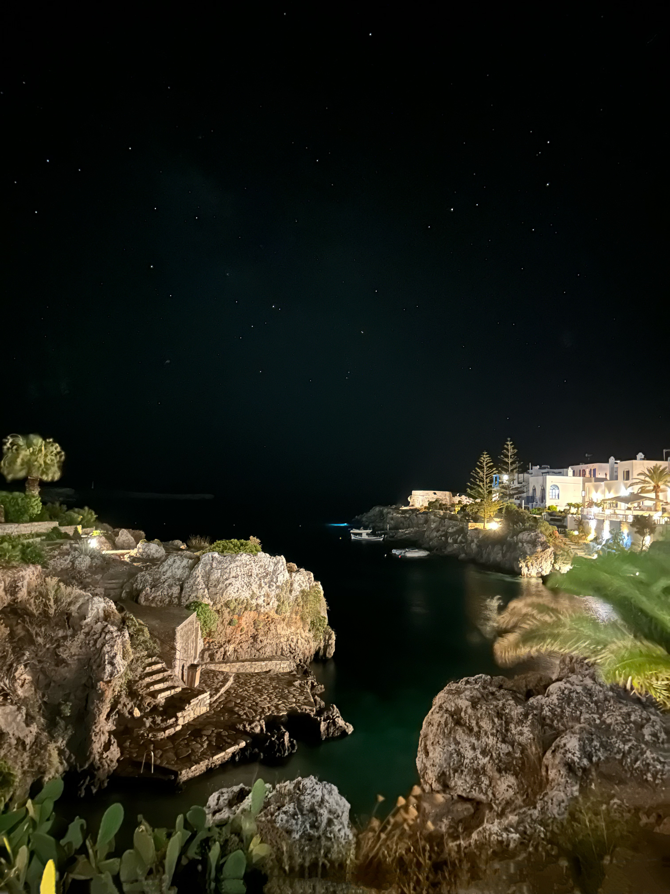

Lovely night in Avlemonas, Kythira.

_TL;DR;_

* Scuba Diving
* Gym
* Concerts, full moon and a week off at Kythira

## Scuba diving 🤿

I was recently going through old photos and discovered that it's been almost ten years since I earned my first certification on Open Water. Man, time flies.

I recently visited the same diving spot; a friend owns it and finally decided it was time for me to do the Advanced OW. It's been a while since I've done scuba; I usually do it once or twice a year. I managed to put together my equipment nicely, checked my air and depth frequently, and even stayed calm while dealing with a BCD inflation malfunction (I needed to use my breath sometimes). I still have three lessons to complete for the certification, but I plan to dive more until the end of August.

## Gym

Gym sessions are going okay. I've not noticed any particular growth, although my physical appearance has changed significantly due to increased calorie intake. I see constant strength gains, though, and that's precisely what I aim for.

## Concerts, full moon and Kythira

The past two weeks have been a lot of fun. There's been a slew of concerts that I've attended, one of them being a jazz band under the full moon in some ancient ruins. Lovely music. I'm writing this blog while sitting on my Airbnb balcony, looking at the sea 🌊. Kythira is so relaxing. I had been here when I was little, and what stayed with me were the crystal clear waters. I've got a mask and fins, and I'm free diving 🤿 every chance I get.

👋🏻
