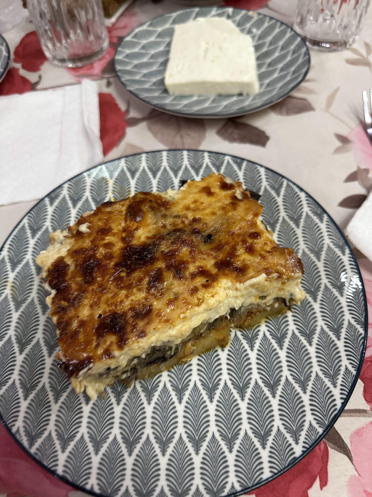

When your mother-in-law offers moussaka, you eat it!

_TL;DR;_

* Friday morning trip to Greece 🇬🇷.
* Fine dining experience 🍽️.
* Diet results and plan for the summer 💪🏻.
* Voting day.

## Friday morning trip to Greece 🇬🇷

Finally! The Greek summer fun time can commence. I woke up early on Friday, dressed, and went straight to the airport. Got some food in me and then quickly got to work. With lounge access, it's nice and cosy. You can get in a few hours of focused work even when you're on the move.

Man, these flights are long! Thankfully I had my phone to keep me company. Played some games, watched some movies, and there I was. I spent significant time at the ATH airport cause I was waiting for a few friends, so this was an all-day trip ✈️!

## Fine dining experience 🍽️

Saturday, I had another one of those Michelin ⭐️experiences at Soil. This one was definitely better than the last. A personal, warm welcome from the chef and the staff followed by a 12-course meal in a beautiful little yard. The menu flowed well, and the dishes were delicious. I went with a juice pairing this time (remember, peeps, be responsible 🚘), and I loved it. The barista made excellent pairing choices and was very professional in explaining why he selected each juice for each dish. 5 stars 🌟!

On the other hand, my friends that went with the wine pairing were extremely underwhelmed and with good reason. The pairing could have been done better, but most of all, it seemed as if the sommelier was on vacation, and their replacement did an inferior job. When you're paying that much money for a pairing, this must not happen. A poor experience. The service was well-orchestrated, and the staff was polite.

Overall the major letdown was the wine pairing. Is it worth the Michelin star? Assuming that the sommelier was present, it's worth the star. I was delighted with my experience, having selected the juice pairing. I recommend the restaurant to someone looking for a fine dining experience in Athens, but it wouldn't be at the top of my list.

## Diet results and plan for the summer

I've been dieting now with some cheat **days**, on the weekends for about a month. I am pleased with the results. I am not nearly as lean as last year, but I would only need more time to achieve that result. However, I want to avoid dieting while I'm in Greece. I want to fully enjoy everything the Greek cuisine offers while I'm here. If you eat a tomato 🍅 in England and one in Greece, trust me, you'll taste the difference.

Another thing is that I've been disappointed with my muscle-building progress. It's been 2 whole years that I've been trying to build more muscle, and even though I've experimented with my food intake and some OTC supplements, I still am not seeing the desired results. I've been looking at changing my workout routine completely. I've run into a workout routine called HIT by Mike Mentzer. It looks promising, and I'll do more research on this in the following weeks.

## Voting day 🇬🇷🗳️

Today is voting day in Greece. I did my part, but I was sad that many people decided not to vote. I'm not big on politics. I have my opinions, but in the end, most citizens and I want politicians and laws that allow us to thrive and progress. 
